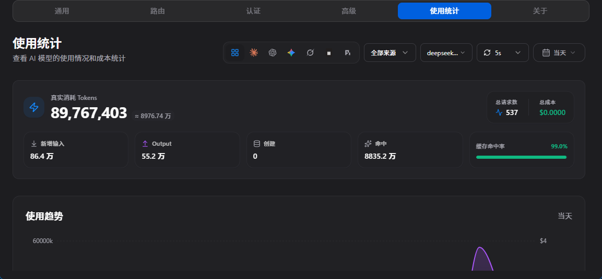

# deepseekv4.1flash
 - 共一轮对话
 - 共计消耗 89767403 token
 - 版本 iris 1.21.11
 - 一轮对话无进行任何其他第二次对话
 - high思考强度

# ccs内计数:


## 从这里往下是llm自述 无任何修改

---

# deepseekv4.1flash — Skyweave

光影名：**Skyweave**（天空织入世界）
目标版本：Minecraft **1.21.11** + **Iris**
包体目录：`Skyweave/shaders/`（打包时把 `Skyweave` 里的内容压成 zip 即可）

---

## 一句话概念

> 天空不是贴在世界背后的一张图，而是照亮世界的那个东西本身。

整套光影只有**一个**大气散射模型。天空穹顶、远处的雾霾、水面倒影、云层受光、以及落在方块上的环境光——全部读同一个散射积分。因此日落变红时，雾会一起变红、阴影里的天光会一起变暖、水面会倒映出同一片天空。它们不可能对不上，因为它们是同一个数。

围绕这个核心，额外做了几件让"同一片天空"更成立的事：

- **太阳和月亮是画出来的**，不是贴图。太阳有自己的角直径和临边昏暗，月亮是按球体被太阳照亮的真实几何算的，所以八个月相、晨昏线的软硬、亏凸和残月全都自动正确。
- **水面反射直接对大气模型求值**。反射方向那条光线真的穿过散射模型走一遍，所以水面倒映的就是抬头能看到的那片天空，包括太阳附近的光晕。
- **极光是签名效果**。夜空里可能出现沿地磁方向垂下的极光帷幕，随经纬度流动、底部边缘参差，冷凉生物群系和晴朗夜晚出现概率更高。它固定在世界坐标上（属于上层大气），不随星空旋转。

---

## 使用情况

### 需要什么

| 项目 | 要求 |
|---|---|
| Minecraft | 1.21.11 |
| Iris | 1.8 或更新的版本 |
| OpenGL | 4.0 以上（使用 `#version 330 compatibility`，不依赖 compute / image / 几何着色器） |
| 显存 | 中等档位约需 1GB 以上（默认 2048 阴影贴图 + 12 个 RGBA16F 缓冲） |

**不需要**任何资源包、PBR 材质或 mod。`block.properties` 缺失时也能跑（彩色光照会退化为统一的暖色灯光，其余功能不受影响）。

### 安装

1. 把 `Skyweave` 文件夹压缩成 zip（压缩包里第一层应当是 `shaders/`）。
2. 放进 `.minecraft/shaderpacks/`。
3. 视频设置 → 着色器 → 选择 `Skyweave`。

### 设置界面

全部选项在"着色器包设置"里，分五页，且提供**中文界面**（`shaders/lang/zh_cn.lang`）：

| 页面 | 内容 |
|---|---|
| 天空 | 散射天空、日月、星空、银河、极光、天空质量、太阳光晕、天光强度 |
| 水体 | 波浪高度/速度、折射、清澈度、水面反光 |
| 光照 | 阴影距离/柔和方式/柔和度、阳光与方块光强度、彩色光照、环境光遮蔽、高光、光滑度、体积光 |
| 世界 | 雾霾强度/高度/距离、雨天雾霾、湿润表面、植物摆动、云质量 |
| 后期 | 色调映射（ACES / AgX / 电影 / 线性）、曝光、自动曝光、饱和度、对比度、辉光、景深、暗角、锐化、颗粒、色散 |

提供五档预设：**土豆 / 低 / 中 / 高 / 极高**。

默认是"高"档的全部功能，但关闭了景深（`DEPTH_OF_FIELD`），因为景深是很主观的效果。

### 性能建议

从高往低依次关：**体积光 → 环境光遮蔽 → 景深 → 天空质量 → 阴影距离**。

- **天空质量**只影响天空穹顶那条光线的采样数，对帧率影响集中在抬头看天时。
- **阴影距离**是影响最大的开关，从 192 降到 64 能省下大量阴影渲染。
- **环境光遮蔽**在 `deferred` 里跑，是逐像素的深度采样，高画质档是 12 个方向 × 8 步。

---

## 技术要点（给想看实现的人）

### 管线

```
shadow          阴影贴图（带朝向玩家的非线性扭曲）
  ↓
gbuffers_*      前向着色，写 colortex0(场景) / 1(反照率+材质) / 2(法线+光滑度) / 3(光照数据)
gbuffers_water  半透明表面写 colortex4/5，不写 colortex0
  ↓
deferred        环境光遮蔽 + 空气透视
composite       半透明表面的合成（水做折射吸收，玻璃冰只做着色）
composite1..4   辉光链（半分辨率亮部 → 四分之一分辨率横向/纵向模糊）
composite5      体积光（半分辨率，步进阴影贴图）
composite6/7    自动曝光测量（渲染到 1×1 缓冲，只跑一个片元）
composite8      合成场景 + 辉光 + 体积光，并应用曝光
composite9      景深（选项关闭时整个 pass 被 `program.composite9.enabled` 禁用）
composite10     色调映射 + 分级 + sRGB 编码
final           色散、锐化、暗角、颗粒 → 屏幕
```

关键设计：**水的合成放在 `composite` 而不是 `deferred`**，因为 Iris 的半透明批次（含 `gbuffers_water`、`gbuffers_weather`）是在 `deferred` **之后**才绘制的。把水写进独立的 colortex4/5 保证了 colortex0 里始终只有不透明几何，折射采样才有正确的背景。

### 大气模型

标准单次散射，Bruneton / Hillaire 的系数：

- 行星半径 6360 km，大气顶 6420 km
- 瑞利散射 `(5.802, 13.558, 33.1) × 10⁻⁶ /m`，标高 8 km
- 米氏散射 `3.996 × 10⁻⁶ /m`，消光 `4.40 × 10⁻⁶ /m`，标高 1.2 km
- 臭氧吸收 `(0.650, 1.881, 0.085) × 10⁻⁶ /m`，峰在 25 km，三角剖面

天空用 22 步主光线 × 4 步太阳透射率；环境光和雾用 6 × 4 步的廉价版本，并在法线方向和天顶方向各取一次做半球平均。

### 阴影扭曲

把阴影贴图中心放大、边缘压缩的莫比乌斯映射：

```
W(r) = r · (1+k) / (1+k·r)      W(0)=0, W(1)=1
```

这样半径 1 仍然映射到半径 1（整张图都用得上），中心得到约 2 倍的纹素密度。顶点端和采样端必须应用**完全同一个函数**，所以它被单独放在 `lib/shadow.glsl` 里由两边共用。

自阴影用**法线偏移**（按阴影纹素的世界尺寸缩放）而不是深度偏移，栅栏、楼梯这些掠射面上表现好得多。

### 颜色空间

`colortex` 里全程存**线性 HDR 光**，只有 `composite10` 做色调映射后再编码到 sRGB。方块贴图是 sRGB，所以采样后立刻线性化；生物群系染色乘在伽马空间里（和原版一致），之后再线性化。

---

## 模型原话

我没有参考任何现有光影的代码。所有 API 事实都来自 Iris 官方文档、OptiFine 的 shader 文档，以及 Iris 的源码本身；数学来自公开论文（Bruneton 的大气散射、Hillaire 的可扩展天空、Fernando 的 PCSS、Jimenez 的 GTAO 与 IGN、Stephen Hill 的 ACES 拟合、Troy Sobotka 的 AgX）。

我想做的不是又一套"能跑的 PBR 管线"，而是一件**有主张**的东西：整套光照必须自洽。所以我没有把天空、雾、环境光写成三个各自调参的独立效果，而是让它们共用同一个积分——这也是为什么这个光影在黄昏时看起来和别人不太一样：那不是调色，那是同一个物理量在三处的读数。

具体到实现，我最满意的三个地方：

1. **月亮是几何算出来的。** 每个像素落在这个圆面上的位置对应球面上的一个法线，拿它和太阳方向点乘就得到了晨昏线。没有相位表、没有贴图，八个月相自然就对，而且亏凸月两侧的软硬程度也是对的。
2. **水面反射是免费的。** 既然已经有大气模型了，反射方向直接丢进去求值就行，不需要环境贴图、不需要反射探针，倒映的就是头顶那片天。
3. **极光是真的会动的。** 用脊状分形在水平面上取两条不同拉伸比例的噪声相乘，得到既成片又有细丝的帷幕，底边用噪声侵蚀出参差的边缘。它固定在世界上不随星空转，因为极光发生在大气层内而不是天球上——这个细节很少有人在意，但对的。

已知的取舍：`gbuffers_water` 同时承载水和玻璃/冰，我用 `block.properties` 里的方块 ID 区分它们。没列进表里的半透明方块会被当作水处理（会折射）。这是刻意的默认，因为在缺少 `block.properties` 的情况下，"像水"比"完全透明"更接近预期。

---

## 校验

这个包在交付前**每一个程序都通过了 glslangValidator 的真实编译**，不是"看起来应该没问题"。

`tools/validate.py` 会：

1. 按 Iris 的规则展开全部 `#include`（以 `shaders/` 为根、前导斜杠、循环检测）；
2. 自动识别 `.vsh`/`.fsh`/`.gsh`/`.csh` 对应的着色器阶段；
3. 编译，并把报错行号映射回**原始文件与行号**；
4. `--sweep` 模式会把每一个布尔开关翻转、每一个数值选项取到列表两端，把所有配置组合都编译一遍。

结果：**50 个程序 / 15 个库（3636 行 GLSL），在全部 15 种选项配置下均编译通过。**

```
$ python tools/validate.py --sweep
--- defaults ---                     50/50 compiled
--- all options at their lowest ---  50/50 compiled
--- all options at their highest --- 50/50 compiled
--- (每个布尔选项各翻转一次) ---       50/50 compiled
all configurations compiled

$ python tools/check_config.py
config is consistent: 51 pack options, all reachable
```

编译这一步抓出的问题（只靠肉眼绝对看不出来）：

- **`#if` 只能处理整数。** `#if FOG_STRENGTH == 0` 里的宏展开成浮点数，预处理器直接报错。浮点选项必须写成运行时判断，让编译器做常量折叠。
- **`colortexNFormat` 的值不是 GLSL 标识符。** Iris 把它当字符串读，但 GLSL 编译器看到的是 `RGBA16F` 这个未声明的名字。必须在同一份文件里把这些格式名定义成宏。
- **`noiseTextureResolution` 被两个库重复定义**，其中一个还是从 `.vsh` 也可见的路径。

读代码时抓出的问题（编译器认为它们完全合法）：

- **阴影顶点着色器漏了扭曲变换。** 采样端按扭曲后的坐标去查，写入端却写的是未扭曲的位置——整张阴影贴图会系统性错位，而且错得很"自然"，看起来像阴影偏移调错了。现在扭曲函数单独放在 `lib/shadow.glsl`，两端共用同一个实现。
- **水的合成放错了 pass。** Iris 的半透明批次（`gbuffers_water` / `gbuffers_weather`）是在 `deferred` **之后**才绘制的，写在 `deferred` 里等于对着一个还没有水的帧做折射。
- **体积光亮度错了约四个数量级。** 累加值约等于步数，乘上步长正好还原成行进距离，所以结果大致是 `辐照度 × 相函数 × 距离 × k`。`k = 0.012` 时正午会算出 16 这个量级，色调映射后整个屏幕纯白。
- **天空的判定不该用材质标记。** 原先把 `MAT_SKY` 写进 `colortex1` 的 alpha 通道，但那个通道受混合影响——一个半透明表面盖在天空上会混出既不等于天空也不等于实体的数值。改用 `depthtex1`（不含半透明几何）判断，深度不会被混合污染。
- **阴影扰动写反了方向。** `r + k·r³` 会把边缘放大、中心不变，正好和"把纹素花在玩家附近"相反，而且 `r=1` 会溢出到贴图之外。改成莫比乌斯形式 `r(1+k)/(1+kr)`，半径 1 仍然映射到半径 1。

---

## 文件结构

```
Skyweave/shaders/
├── shaders.properties        选项屏幕布局、缓冲区尺寸、程序开关、混合状态、预设
├── block.properties          方块 ID（彩色光照与材质分类用）
├── lang/
│   ├── en_us.lang            英文标签
│   └── zh_cn.lang            简体中文标签
├── lib/                      15 个共享库，2403 行
│   ├── config.glsl           所有用户选项的 #define（值列表与提示文字）
│   ├── uniforms.glsl         Iris uniform 声明（逐个核对过 Iris 的注册表）
│   ├── math.glsl             哈希、噪声、低差异序列、空间变换
│   ├── atmosphere.glsl       单次散射模型
│   ├── sky.glsl              日月星空银河极光 + 维度天空
│   ├── surface.glsl          所有受光几何体共用的着色模型
│   ├── lighting.glsl         BRDF、自发光颜色表、湿润与雨波纹
│   ├── shadow.glsl           阴影扭曲、PCF / PCSS、法线偏移
│   ├── water.glsl            程序化波浪、水体吸收
│   ├── color.glsl            色彩空间、四种色调映射、分级、暗角与颗粒
│   ├── post.glsl             环境光遮蔽、空气透视、体积光、辉光提取
│   ├── materials.glsl        方块分类与材质判定
│   ├── buffers.glsl          渲染目标格式与清除行为
│   ├── gbuffer_vertex.glsl   世界几何体共用的顶点阶段（含植物摆动）
│   └── fullscreen.glsl       全屏 pass 共用的顶点阶段
└── *.vsh / *.fsh             50 个程序（见上面的管线图）
```

`tools/` 目录（不属于光影包，仅供开发校验）：

| 文件 | 用途 |
|---|---|
| `validate.py` | 展开 include → 编译 → 行号映射回原文件；`--sweep` 扫描全部选项组合 |
| `check_config.py` | 双向核对 `shaders.properties` 与着色器里实际声明的选项，并模拟 Iris 的选项发现规则 |

---

## 已知限制

- **没有做 TAA / 时域抗锯齿。** 体积光和阴影的抖动是逐帧变化的蓝噪声，静态画面下会有轻微噪点。这是刻意取舍——TAA 需要运动矢量和历史缓冲，会让整条管线的复杂度和出错面大幅上升。
- **极光的出现是伪随机的。** 按游戏内天数做哈希决定当晚有没有极光，再乘上生物群系温度与天气。不是真实的太阳活动模拟。
- **玻璃/冰的判定依赖 `block.properties`**，未列出的半透明方块会被当作水。
- `gbuffers_entities_translucent` 等半透明实体程序会回退到 `gbuffers_textured_lit`，它们的混合状态会轻微污染材质缓冲的数值（表现为这些实体附近的遮蔽略微偏色），影响范围很小。
- **没有 Nether/End 的专属光照模型**：用 `hasCeiling` / `hasSkylight` 区分维度，各给了一套独立的天空与雾色，但没有为下界重新调一套材质参数。
