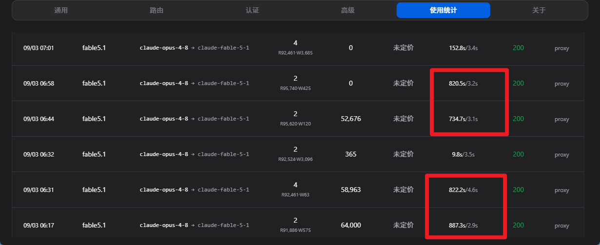

# fable5.1
 - 共一轮对话
 - 共计消耗 18140342 token
 - 版本 iris 1.21.11
 - 一轮对话无进行任何其他第二次对话

# ccs内计数:


> 值得一提的是 这个模型开max挡位太吃时间了 导致我总共开了两次**会话**(不是对话) 上面的共计是两个的总和

## 从这里往下是llm自述 无任何修改

---

# Ambergale

A shader pack for Minecraft 1.21.11 running on Iris, built from scratch around one idea: light that feels like late afternoon amber falling through moving air. Everything in the pack is procedural and written in GLSL 330 compatibility profile.

## Features

- Deferred lighting for opaque geometry with a world-space gbuffer (albedo, lightmap, material id, ambient occlusion, normal)
- Soft shadows using a Vogel disk filter over a camera-weighted distorted shadow map, with tinted translucent shadows from stained glass and pale water shadows
- Procedural sky with a dusk halo that stretches along the horizon, a cool counter-glow toward the moon, twinkling stars and two drifting cloud layers lit by a density gradient toward the sun
- Screen-space light shafts rendered at quarter resolution
- Wind field that gusts over grass, crops, leaves, vines and seagrass, gated by sky exposure so caves stay still
- Forward-lit water with layered wave normals, sky reflections, sun highlights, depth-based absorption and screen-space refraction that only accepts samples still behind the surface
- Warm block light with a slow ember flicker, held-item lighting and wet surface gloss during rain
- Height-weighted fog that thickens at dusk and in rain, plus underwater, lava and powder snow fog
- Quarter-resolution bloom, sky-adaptive exposure, a custom filmic S-curve, split toning, vignette and film grain
- Nether and End variants through `world-1` and `world1` folders

## Layout

```
Ambergale/shaders/
  lib/          shared GLSL (settings, sky, shadow, lighting, water, wind, fog, materials)
  program/      shared vertex and fragment bodies included by the thin program wrappers
  lang/         option labels in English and Simplified Chinese
  world-1/      Nether copies with DIM_NETHER defined
  world1/       End copies with DIM_END defined
  *.vsh *.fsh   Iris program entry points
  shaders.properties, block.properties
```

## Tooling

- `generate.ps1` rewrites every thin wrapper and regenerates both dimension folders from the root programs. Run it after editing anything in `program/` or adding a new program.
- `validate.ps1` expands includes the same way Iris does and compiles every program with `glslangValidator` from the Vulkan SDK. It reports the number of programs that compiled and prints errors for any that failed.

## Installing

Copy the `Ambergale` folder into `.minecraft/shaderpacks` and select it in Iris. Options live under Lighting, Shadows, Atmosphere, Water and Post Processing, with Low, Medium and High profiles.
